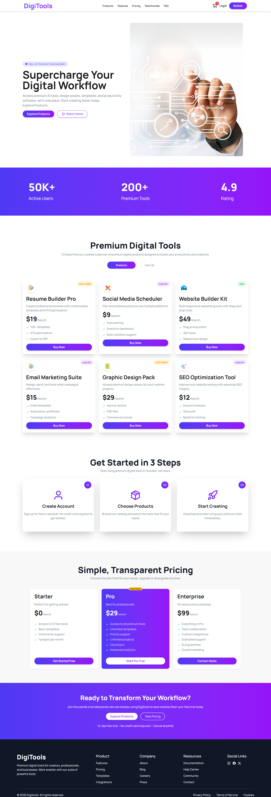
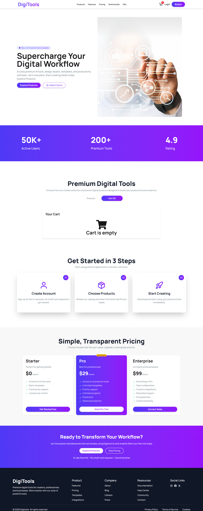
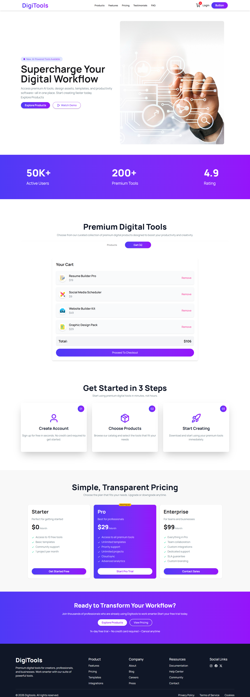

<div align="center">

# 💻 DigiTools Platform

### *Your ultimate hub for premium digital assets*

A modern digital marketplace where users can explore, manage, and purchase high-quality digital tools with a seamless experience.

<br/>


[](https://react.dev/)
[](https://tailwindcss.com/)
[](https://daisyui.com/)
[]()

</div>

---

## 🚀 Overview

DigiTools Platform is a **high-performance digital product marketplace** built with React. It transforms a modern Figma design into a fully interactive, responsive web application.

The goal of this project is to simulate a real-world SaaS product experience — from browsing digital tools to managing a dynamic shopping cart with live updates.

---

## 🌐 Live Demo

👉 **[View Live Project](https://digi-tools-platform-a6-ph.netlify.app/)**

---

## ✨ Key Highlights

- ⚡ Pixel-perfect Figma to React conversion  
- 🛒 Fully dynamic shopping cart system  
- 🔄 Real-time UI updates without page reload  
- 📱 Fully responsive (Mobile / Tablet / Desktop)  
- 🎨 Modern glassmorphism UI design  
- 🔔 Toast notifications for user actions  
- 🧠 Clean component-based architecture  

---

## 📸 Product Showcase

### 🏠 Marketplace Dashboard



Browse premium digital tools in a clean, responsive grid layout with detailed pricing, feature highlights, and a modern shopping experience.

---

<details>
<summary><strong>🛒 Empty Cart State</strong></summary>
<br/>



> A clean and intuitive empty-state interface that gracefully guides users back to explore available products.

</details>

---

<details>
<summary><strong>💳 Active Cart Experience</strong></summary>
<br/>



> A dynamic cart experience featuring real-time updates, item management, and instant total price calculation for a seamless checkout flow.

</details>

---

## 🧠 Features

### 📦 Product System
- Responsive 3-column product grid
- Badge system (New / Popular / Best Seller)
- Feature-rich product cards

### 🔄 State Management
- Add / Remove products instantly
- Live cart counter updates
- Persistent UI state handling

### 🛒 Cart System
- Dynamic cart updates
- Real-time total calculation
- Checkout reset functionality

### 🔔 UX Enhancements
- React Toastify notifications
- Smooth transitions & feedback
- Clean and modern UI interactions

---

## 🛠 Tech Stack

| Technology | Purpose |
|------------|--------|
| React 18 | Frontend Framework |
| Tailwind CSS | Styling & Responsiveness |
| DaisyUI | UI Components |
| React Toastify | Notifications |
| React Icons | Icon System |
| JSON | Mock Data Handling |

---

## 🚀 Getting Started

```bash
git clone https://github.com/abutalha08/digitools-platform.git
cd digitools-platform
npm install
npm run dev
```

---

## 📱 Responsive Design

DigiTools Platform is fully responsive and optimized for all screen sizes, including mobile, tablet, and desktop devices. The layout adapts seamlessly to ensure a smooth and consistent user experience across all platforms.

---

## 💙 Author

<div align="center">

Made with 💙 by [Abu Talha Taufique](https://github.com/abutalha08)

*DigiTools — Empowering your digital workflow with precision and simplicity.*

© 2026 DigiTools Platform. All rights reserved.

</div>